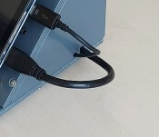
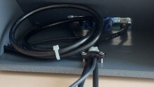

# Example Setup

This document describes an exemplary setup with a Basys3 FPGA board, a display and a keyboard for easy experimentation of circuits on the Basys3 board.

## Parts list

- Basys3 FPGA board (https://digilent.com/reference/programmable-logic/basys-3/start)
- Joy-IT 7 inch LCD display RB-LCD-7-3 (https://joy-it.net/en/products/RB-LCD-7-3) (the touch functionality is not used)
- Keysonic ACK-3401U (https://keysonic.de/product/ack-3401u/) (any USB keyboard is supposed to work, however in practice some USB keyboards were found to not work properly, so some trial and error might be necessary)
- 2 x USB cable (USB A (male) -> Micro USB (male)) (one for connecting the Basys3 board to the computer, one for supplying power to the display)
- USB extension cable (USB A (male) -> USB A (female)) (for connecting the keyboard to the Basys3 board)
- USB charger (for supplying power to the display)
- Custom parts (in [technical drawings/](technical_drawings/)):
    - [Display base plate](technical_drawings/Display_Baseplate.pdf)
    - [Display cover](technical_drawings/Display_Cover.pdf)
    - [Side panel left](technical_drawings/Sidepanel_Left.pdf)
    - [Side panel right](technical_drawings/Sidepanel_Right.pdf)
    - [FPGA base plate](technical_drawings/FPGA_Baseplate.pdf)
    - [FPGA cover](technical_drawings/FPGA_Cover.pdf)
    - [Button knobs](technical_drawings/Button_Knobs.pdf)
- 4 x plastic 5mm spacer sleeves
- 4 x metal 10mm spacer bolts
- 15.5mm hole spacing strain relief
- 4 x M3 plastic nuts
- various M3 countersunk screws

## Assembly

1. Mount the display on the display base plate using 12 mm spacer
bolts (supplied with the display). Also mount the display cover on the
top side at the same time.

    

2. Screw the side panels to the display base plate (note right/left).

3. Mount the FPGA board on the FPGA base plate. Use countersunk screws
from below, 5mm spacer sleeves (plastic) at the top, then screw the
FPGA board in place with 10mm spacer bolts (metal).

4. Mount the FPGA cover made of Plexiglas. To do this, insert the
button knobs first. Screw on the FPGA cover with plastic nuts M3.

    

5. Connect the RGB connection cable (included with the display) to the
display. Connect the USB charging cable to the display.

    

6. Mount the display unit on the FPGA base plate (M3 countersunk
screws from below). To do this, first guide the cables coming from the
display through the cut-outs on the right-hand side panel.

7. Connect the cables to the FPGA board, if necessary organize them
with cable ties.
 
8. Secure outgoing cables with strain relief (hole spacing 15.5mm).

    

## Authors and Contributors

- [Klaus Kulitza](https://ekvv.uni-bielefeld.de/pers_publ/publ/PersonDetail.jsp?personId=5314955) (design, technical drawings, assembly instructions)
- [Jonas Keller](https://github.com/jonicho) (adaptation for this repository)
